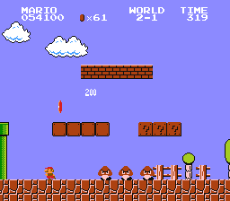
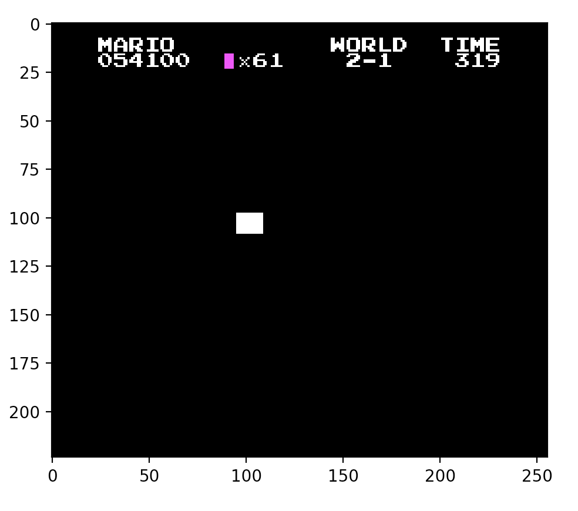

# image_segmentation_data_prep

A simple python program that labels UI elements in Super Mario Bros NES (1985) to be fed into a UI segmentation model. Pixels that correspond to text UI elements are labelled with white.The gold icon at the top of the screen is a different type of UI element (not text), so the pixels corresponding to it are labelled with magenta.  

When an enemy is destroyed a score is earned and printed on the screen. Since this text can appear at various locations on the screen, template matching is used to detect it. 

## Technologies

- Python 3.8.5
- Packages Used: cv2, numpy, matplotlib

## Usage 

Program can be used by running the mario_bros_label_data.py file. The game screen shot images should be in the images directory and should have .png extensions. 

## Illustrations

Below is an example of a screen shot from the game and the output of this program when given that screen shot. 

